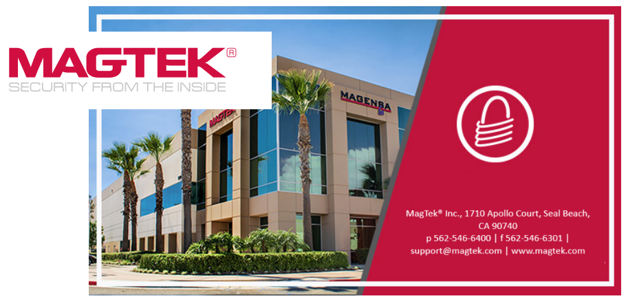

# Overview

Welcome to the MagTek **Web Demo Hub** where developers can explore the future of secure payment technology with MagTek's hardware and gateway offerings!

At MagTek, we’re dedicated to providing seamless, secure, and innovative payment and identification solutions. This hub is designed to give developers, partners, and customers the resources they need to get the most out of MagTek’s hardware devices, software and services. Whether you’re building an integration or exploring new features, we’ve gathered everything you need in one easy-to-navigate hub.

Here’s what you’ll find:

This interactive portal puts powerful tools in your hands, letting developers, integrators, and testers engage directly with a wide array of MagTek Secure Card Reader Authenticators (SCRAs) and its Magensa cloud services. From EMV and NFC to MSR, barcodes and PIN entry, each demo showcases real-time communication using modern protocols like Web HID, MQTT, and WebSocket. Whether you’re validating device behavior, integrating with your POS, or exploring Magensa’s transaction gateway capabilities, this page accelerates your path to market with clarity, confidence, and innovation.

## Contact Us:

**MagTek 1710 Apollo Court I Seal Beach, CA 90740** 
Phone: (562) 546-6400 
Technical Support: (562) 546-6800 
[www.magtek.com](https://www.magtek.com)

**About MagTek:**

Founded in 1972, MagTek is a leading manufacturer of electronic systems for the reliable issuance, reading, transmission, and security of cards, barcodes, checks, PINs, and identification documents. Leading with innovation and engineering excellence, MagTek is known for quality and dependability. Its products include secure card reader/authenticators, Qwantum secure cards, token generators; EMV Contact Chip, EMV Contactless, barcode and NFC reading devices; encrypting check scanners, PIN pads, and credential personalization systems. These products are used worldwide by financial institutions, retailers, payment processors, and ISVs to provide efficient and private electronic transactions.

**MagTek is headquartered in Seal Beach, CA**. For more information, please visit www.magtek.com.

Copyright 2025 ©: Version 1.0.0.0
